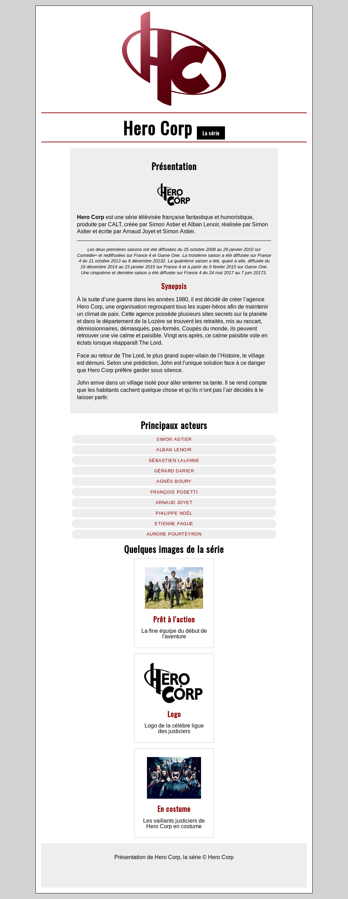

# Hero-corp

Zou, le box-model en pratique !

## Instructions
Vous allez devoir reproduire les visuels vus ici dans une intégration HTML/CSS. Pas de panique, vous avez les contenus dans différents répertoires. Repérez bien chaque partie du visuel et isolez la dans une balise à part... N'hésitez pas à faire le plan de votre HTML sur une feuille de papier. Chacun sa méthode !!
- Les textes sont dispo dans le fichier `textes.txt`
- Les visuels sont disponibles dans le dossier `images` du projet

Vous pourrez faire les bonus si vous avez le temps, mais la première étape peut vous prendre déjà pas mal de temps... Si vous avez des questions : direction Slack !!

## BONUS

- Ajouter un bloc `La série` dans le titre
- Utiliser la font Oswald pour garantir le rendu des titres, un tour sur [Google fonts](https://fonts.google.com/) devrait vous aider - C'est à vous de trouver comment faire :)
- Afficher la liste des acteurs

- Un lien vers un site distant doit être placé sur chaque acteur, le lien doit s'ouvrir dans une page différente 
- Les liens survolés doivent réagir (fond et couleur en respectant l'arrondi)
- Gérer les blocs d'images 

